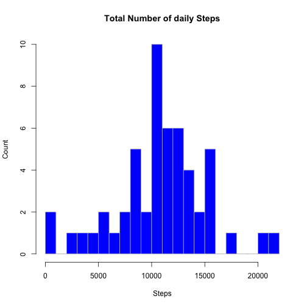
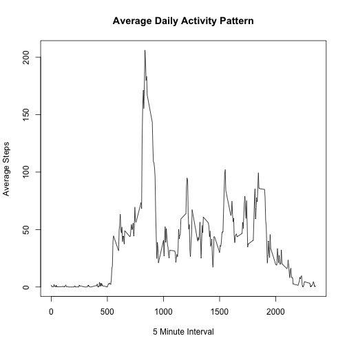
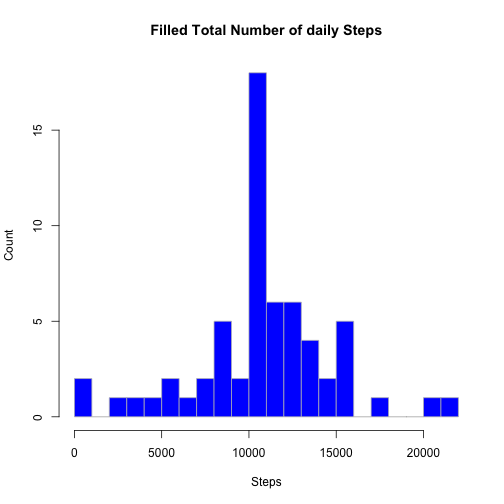
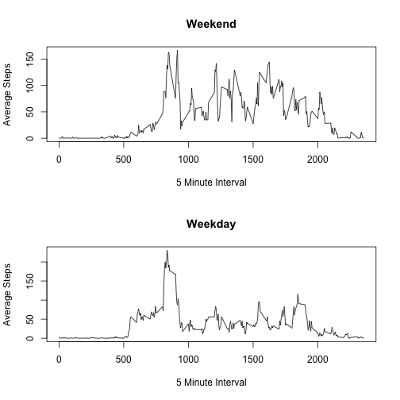
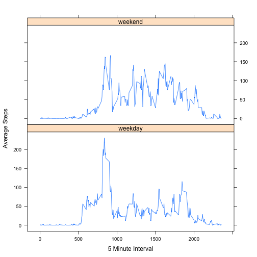

Introduction
--
It is now possible to collect a large amount of data about personal movement using activity monitoring devices such as a Fitbit, Nike Fuelband, or Jawbone Up. These type of devices are part of the "quantified self" movement - a group of enthusiasts who take measurements about themselves regularly to improve their health, to find patterns in their behavior, or because they are tech geeks. But these data remain under-utilized both because the raw data are hard to obtain and there is a lack of statistical methods and software for processing and interpreting the data.

This assignment makes use of data from a personal activity monitoring device. This device collects data at 5 minute intervals through out the day. The data consists of two months of data from an anonymous individual collected during the months of October and November, 2012 and include the number of steps taken in 5 minute intervals each day.

##Assignment Questions 
###What is mean total number of steps taken per day?
* For this part of the assignment, you can ignore the missing values in the dataset.
* Calculate the total number of steps taken per day
* Make a histogram of the total number of steps taken each day
* Calculate and report the mean and median of the total number of steps taken per day


```r
inputFile1 <- "activity.csv"
Activities <- read.csv(inputFile1, header = TRUE)
StepDailySum = aggregate(steps ~ date, Activities, FUN = "sum", na.rm = TRUE)
DailyMeanSteps <- mean(StepDailySum$steps)
DailyMedianSteps <- median(StepDailySum$steps)

hist(StepDailySum$steps, main = "Total Number of daily Steps", xlab = "Steps", 
    ylab = "Count", border = "grey", col = "blue", breaks = 20)
```

 


```
##   Mean steps per day: 10766.19 
## Median steps per day: 10765
```

###What is the average daily activity pattern?
* Make a time series plot (i.e. type = "l") of the 5-minute interval (x-axis) and the average number of steps taken, averaged across all days (y-axis)
* Which 5-minute interval, on average across all the days in the dataset, contains the maximum number of steps?


```r
IntervalMeanSteps = aggregate(steps ~ interval, Activities, FUN = "mean", na.rm = TRUE)
MaxIntervalValue <- max(IntervalMeanSteps$steps)
MaxIntervalIndex = which(IntervalMeanSteps$steps == MaxIntervalValue)
MaxInterval = IntervalMeanSteps$interval[MaxIntervalIndex]
plot(IntervalMeanSteps$interval, IntervalMeanSteps$steps, type = "l", xlab = "5 Minute Interval", 
    ylab = "Average Steps", main = "Average Daily Activity Pattern")
```

 


```
## Maximium steps: 206.1698  occurred in interval: 835
```

###Imputing missing values
* Calculate and report the total number of missing values in the dataset (i.e. the total number of rows with NAs)
* Devise a strategy for filling in all of the missing values in the dataset. The strategy does not need to be sophisticated. 
* Create a new dataset that is equal to the original dataset but with the missing data filled in.
* Make a histogram of the total number of steps taken each day and Calculate and report the mean and median total number of steps taken per day. 
* Do these values differ from the estimates from the first part of the assignment? 
* What is the impact of imputing missing data on the estimates of the total daily number of steps?

####Strategy for filling in missing step values (STEPS = NA)
When the supplied data contains a NA for the Step value the value is updated to be the average step value for the same interval across all the other days. 


```r
TMV = sum(is.na(Activities$steps))
# If the steps value is NA then use the average value from the other days.
FillValue <- function(steps, interval) {
    Filler <- NA
    if (!is.na(steps)) 
        Filler <- c(steps) else Filler <- (IntervalMeanSteps[IntervalMeanSteps$interval == interval, 
        "steps"])
    return(Filler)
}
FilledActivities = Activities
FilledActivities$steps = mapply(FillValue, FilledActivities$steps, FilledActivities$interval)
FilledStepDailySum = aggregate(steps ~ date, FilledActivities, FUN = "sum", 
    na.rm = TRUE)
FilledMeanSteps <- mean(FilledStepDailySum$steps)
FilledMedianSteps <- median(FilledStepDailySum$steps)
hist(FilledStepDailySum$steps, main = "Filled Total Number of daily Steps", 
    xlab = "Steps", ylab = "Count", border = "grey", col = "blue", breaks = 20)
```

 


```
##           Total Missing Values: 2304 
##   Filled in Mean steps per day: 10766.19 
## Filled in Median steps per day: 10766.19
```

###Are there differences in activity patterns between weekdays and weekends?
* Use the dataset with the filled-in missing values for this part.
* Create a new factor variable in the dataset with two levels - "weekday" and "weekend" indicating whether a given date is a weekday or weekend day.
* Make a panel plot containing a time series plot (i.e. type = "l") of the 5-minute interval (x-axis) and the average number of steps taken, averaged across all weekday days or weekend days (y-axis). 

#### Approach 1 - Single plots

```r
FilledActivities$InWeekend <- weekdays(as.Date(FilledActivities$date)) %in% 
    c("Saturday", "Sunday")

weekend <- FilledActivities[FilledActivities$InWeekend == TRUE, ]
weekday <- FilledActivities[FilledActivities$InWeekend == FALSE, ]
weekendAverages <- aggregate(steps ~ interval, weekend, FUN = "mean")
weekdayAverages <- aggregate(steps ~ interval, weekday, FUN = "mean")

par(mfrow = c(2, 1))
plot(weekendAverages$interval, weekendAverages$steps, type = "l", xlab = "5 Minute Interval", 
    ylab = "Average Steps", main = "Weekend")
plot(weekdayAverages$interval, weekdayAverages$steps, type = "l", xlab = "5 Minute Interval", 
    ylab = "Average Steps", main = "Weekday")
```

 

#### Approach 2 - Consolidated Plot

```r
FilledActivities$weekend <- ifelse(weekdays(as.Date(FilledActivities$date)) %in% 
    c("Saturday", "Sunday"), "weekend", "weekday")
DayTypeAverages = aggregate(steps ~ interval + weekend, FilledActivities, FUN = "mean", 
    na.rm = TRUE)

xyplot(steps ~ interval | weekend, DayTypeAverages, type = "l", lwd = 1, xlab = "5 Minute Interval", 
    ylab = "Average Steps", layout = c(1, 2))
```

 

